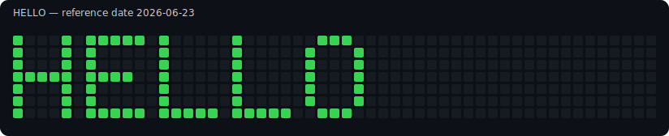

# Grid Graffiti



A tiny Python art hack that turns text into a GitHub-style contribution grid.

I made this as a fun hacking project to stretch my creative Python chops: bitmap
fonts, calendar math, Git internals, SVG output, and just enough chaos to make a
terminal feel like a sketchbook.

The script renders text into a 5x7 pixel font, maps the lit pixels onto the
53-week contribution calendar layout, and can create a brand-new local Git
repository with dated commits for each lit cell.

## What It Does

- Converts text into a 5x7 bitmap font.
- Maps the bitmap onto a 53-column by 7-row contribution grid.
- Prints an ASCII preview before doing anything destructive.
- Exports a `grid-preview.svg` image.
- Exports a `grid-dates.csv` manifest of the planned commit dates.
- Optionally creates a fresh local-only Git repository with backdated commits.
- Refuses to write into a non-empty output directory.
- Refuses to operate on a repo with remotes configured.

## Quick Start

Preview a message:

```bash
python3 grid_graffiti.py "HELLO"
```

Preview against a specific reference date:

```bash
python3 grid_graffiti.py "HELLO" --today 2026-06-20
```

Create a new local demo repository:

```bash
python3 grid_graffiti.py "HELLO" --write-repo --output-dir hello-grid
```

Center the text and use stronger contribution intensity:

```bash
python3 grid_graffiti.py "HELLO" --align center --commits-per-pixel 3 --write-repo
```

Set the commit contributor explicitly:

```bash
python3 grid_graffiti.py "HELLO" \
  --author-name "Your Name" \
  --author-email "123456+yourhandle@users.noreply.github.com" \
  --write-repo
```

If installed as a package, the same CLI is available as:

```bash
grid-graffiti "HELLO"
```

## Requirements

- Python 3.10 or newer
- Git on your `PATH`
- No third-party Python packages

## Supported Characters

The built-in font supports:

```text
A-Z 0-9 space ! ? - .
```

Text is normalized to uppercase before rendering.

## How The Calendar Mapping Works

The grid follows the familiar GitHub contribution calendar shape:

- 53 columns, one for each week
- 7 rows, Sunday through Saturday
- The rightmost column is the week containing `--today`
- The leftmost column starts 52 weeks before that

Each lit pixel maps to one calendar day. When `--write-repo` is enabled, the
script writes one or more commits for that date using `GIT_AUTHOR_DATE` and
`GIT_COMMITTER_DATE`.

Generated commits use `--author-name` and `--author-email` when provided.
Otherwise, Grid Graffiti reads your current Git `user.name` and `user.email`.
If neither is configured, it falls back to a demo identity. For GitHub
contributor attribution, pass an email attached to your GitHub account, such as
your GitHub noreply email.

## Repository Files

- `grid_graffiti.py` - the script
- `grid-preview.svg` - preview image for the sample `HELLO` grid
- `grid-dates.csv` - sample manifest of lit cells and dates
- `pixels.txt` - sample generated commit payload from the demo repository
- `tests/` - zero-dependency test suite
- `pyproject.toml` - package metadata and console script entry point
- `DISCLAIMER.md` - safety, ethics, and usage notes
- `CHANGELOG.md` - release notes
- `LICENSE` - MIT license

## Development

Run the tests:

```bash
python3 -m unittest discover
```

Run the CLI help:

```bash
python3 grid_graffiti.py --help
```

Build/install tooling is intentionally minimal. The runtime has no third-party
Python dependencies.

## Important Disclaimer

This is an educational and artistic project. It creates synthetic commit history
in a new local repository. Do not use it to misrepresent real work, inflate your
activity, or deceive people reviewing your GitHub profile.

The script does not push to GitHub, add remotes, or modify an existing non-empty
folder. If you choose to publish a generated repository, you are responsible for
how that history is presented and whether it complies with the norms and rules
of the platform where you publish it.

Read [DISCLAIMER.md](DISCLAIMER.md) before using `--write-repo`.

## Why This Exists

Because creative coding is a great way to learn. This project is less about
"gaming the graph" and more about poking at the boundary where Python, time,
visual systems, and Git metadata all meet.

It is a tiny toy, but it touches real concepts:

- bitmap rendering
- deterministic date math
- CLI design
- subprocess handling
- Git author and committer metadata
- generated SVG and CSV artifacts

## License

MIT. See [LICENSE](LICENSE).
